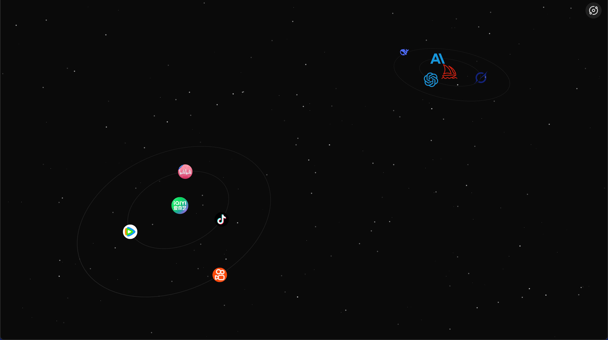

<p align="center">
  
</p>

<h1 align="center">StellarDex</h1>
<div align="center">
  简体中文 ｜ <a href="./README_EN.md"> English </a>
</div>

---

## ✨ 项目简介

StellarDex 是一个基于 Golang + Next 实现的导航页应用。

## 🚀 功能特性

- 多模式支持
- 多风格展示
- 中英文支持
- 多用户登录
- 自定义站点信息
- 浅色/深色模式切换
- 响应式设计，适配多终端

## 📸 预览
<div align="center">
  &nbsp;&nbsp;
  
</div>

<div align="center" style="margin-top: 20px">
  &nbsp;&nbsp;
  
</div>

## 📦 开发&部署

### 本地开发
1. 克隆本仓库到本地：
```bash
    git clone github.com/shichen437/stellardex.git
```
2. 进入项目目录：
```bash
    cd stellardex
```
3. 安装依赖：
```bash
    go mod tidy
    # 热更新需安装gf-cli
    make cli-install
```
4. 启动后端服务：
```bash
    go run main.go
    # 热更新
    gf run main.go
```
5. 进入前端目录：
```bash
    cd web
```
3. 安装依赖：
```bash
    npm install
```
4. 启动开发服务器：
```bash
    npm run dev # 或 yarn dev
```
5. 访问 URL_ADDRESS:3000 查看应用。

### Docker 部署
1. 复制示例文件到本地并重命名:
```bash
    cp docker-compose.yaml.example docker-compose.yaml
```
2. 修改配置文件:
```bash
    vim docker-compose.yaml
```
3. 环境变量参数:
    <table>
    <tr align="center">
      <th>变量名</th>
      <th>变量描述</th>
      <th>默认值</th>
      <th>是否必填</th>
    </tr>
    <tr align="center">
      <td>PROJECT_SM4KEY</td>
      <td>sm4加密 key</td>
      <td>abcdefghijklmnopqrstuvwxyz123456 (32位字符串)</td>
      <td>否</td>
    </tr>
    <tr align="center">
      <td>PROJECT_LANG</td>
      <td>系统语言</td>
      <td>zh-CN</td>
      <td>否</td>
    </tr>
    <tr align="center">
      <td>TZ</td>
      <td>时区</td>
      <td>Asia/Shanghai</td>
      <td>否</td>
    </tr>
    </table>
4. 启动服务:
```bash
    docker-compose up -d
```
5. 访问 URL_ADDRESS:{YOUR_PORT} 查看应用。

## 🛠️ 技术栈
- 后端：Goframe / sqlite
- 前端：React / Next.js
- 样式：Tailwind CSS / shadcnUI / MagicUI / Three.js

## 🎨 SVG 图标网站推荐
- [Lucide](https://lucide.dev/icons)
- [iconfont](https://www.iconfont.cn)

## 🤝 贡献
欢迎提交 issue 或 PR，参与项目共建！

## 📄 开源协议
MIT

## 🔗 感谢
- [Goframe](https://github.com/gogf/gf)
- [golang-migrate](https://github.com/golang-migrate/migrate)
- [Next.js](https://github.com/vercel/next.js)
- [Three.js](https://github.com/mrdoob/three.js)
- [shadcn UI](https://github.com/shadcn-ui/ui)
- [Magic UI](https://github.com/magicuidesign/magicui)