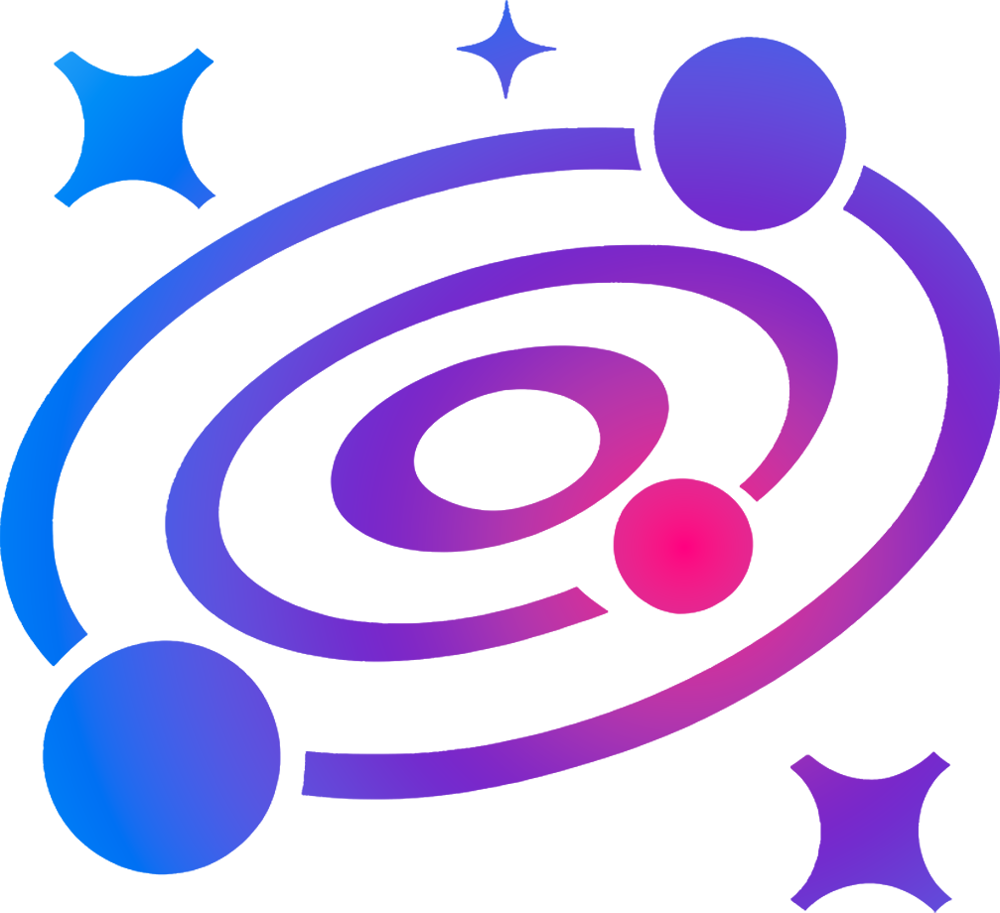
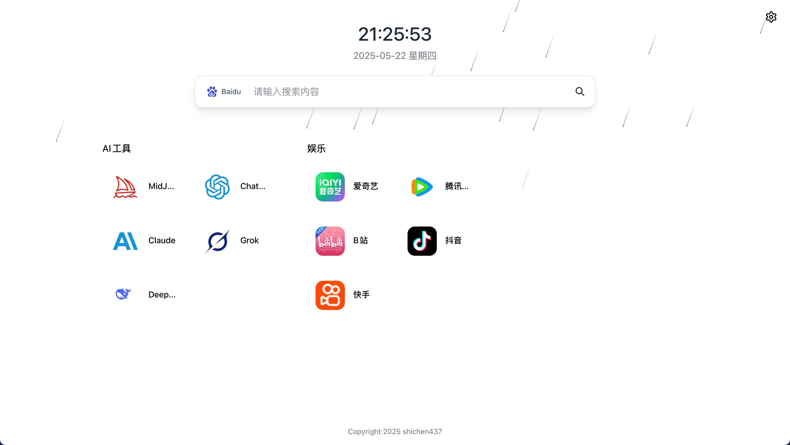
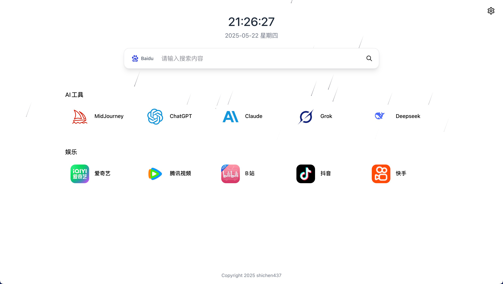
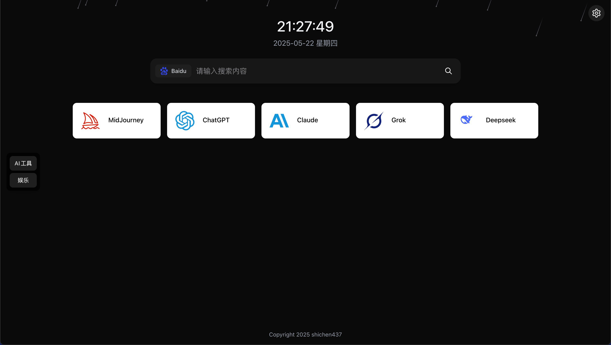
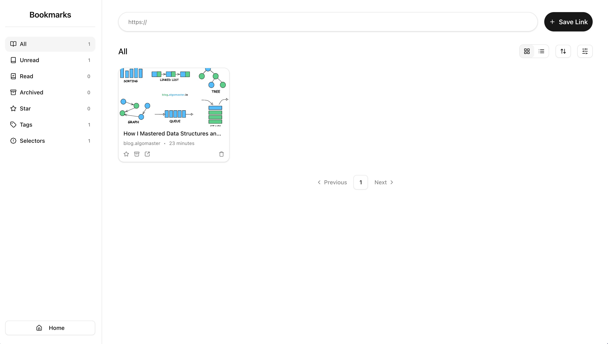

<p align="center">
  
</p>

<h1 align="center">StellarDex</h1>
<p align="center">
  <a>
    
  </a>
  <a href="https://github.com/shichen437/stellardex/discussions/" target="_blank">
    
  </a>
  <a href="https://hub.docker.com/u/shichen437" target="_blank">
    
  </a>
  <a>
    
  </a>
</p>
<div align="center">
  <a href="./README.md">简体中文</a> ｜ English
</div>

---

## ✨ Project Introduction

StellarDex is a navigation page application implemented with Golang + Next.js.

## 🚀 Features

- Bookmarks
- Multi-user login
- Hardware monitoring
- Multiple style icons
- Multiple display modes
- Light/Dark mode toggle
- Customizable site information
- Chinese/English language support
- Responsive design for multiple devices

## 📸 Preview
<div align="center">
  &nbsp;&nbsp;
  
</div>

<div align="center" style="margin-top: 20px">
  &nbsp;&nbsp;
  
</div>

## 📦 Docker Deployment

### docker image deployment

> Init account：admin/stellardex

1. Pull image:
```bash
    docker pull shichen437/stellardex:latest
```
2. Run container:
```bash
    docker run -d \
    -p 9527:9527 \
    -v /stellardex:/stellardex/resource/data \
    -e PROJECT_SM4KEY=abcdefghijklmnopqrstuvwxyz123456 \
    -e PROJECT_LANG=en \
    -e TZ=Asia/Shanghai \
    --name stellardex \
    --restart=always \
    shichen437/stellardex:latest
```
3. Visit URL_ADDRESS:{YOUR_PORT} to view the application.

### docker-compose deployment
1. Copy example file and rename:
```bash
    cp docker-compose.yaml.example docker-compose.yaml
```
2. Modify configuration:
```bash
    vim docker-compose.yaml
```
3. Environment variables:
    <table>
    <tr align="center">
      <th>Variable</th>
      <th>Description</th>
      <th>Default</th>
      <th>Required</th>
    </tr>
    <tr align="center">
      <td>PROJECT_SM4KEY</td>
      <td>SM4 encryption key</td>
      <td>abcdefghijklmnopqrstuvwxyz123456 (32 chars)</td>
      <td>No</td>
    </tr>
    <tr align="center">
      <td>PROJECT_LANG</td>
      <td>System language</td>
      <td>zh-CN</td>
      <td>No</td>
    </tr>
    <tr align="center">
      <td>TZ</td>
      <td>Timezone</td>
      <td>Asia/Shanghai</td>
      <td>No</td>
    </tr>
    </table>
4. Start services:
```bash
    docker-compose up -d
```
5. Visit URL_ADDRESS:{YOUR_PORT} to view the application.

## 🛠️ Tech Stack
- Backend: Goframe / sqlite
- Frontend: React / Next.js
- Styling: Tailwind CSS / shadcnUI / MagicUI / Three.js

## 🎨 SVG Icon Resources
- [Lucide](https://lucide.dev/icons)
- [iconfont](https://www.iconfont.cn)

## 🤝 Contributions
Welcome to submit issues or PRs!

## 📄 License
MIT

## 🔗 Acknowledgements
- [Goframe](https://github.com/gogf/gf)
- [golang-migrate](https://github.com/golang-migrate/migrate)
- [Next.js](https://github.com/vercel/next.js)
- [Three.js](https://github.com/mrdoob/three.js)
- [shadcn UI](https://github.com/shadcn-ui/ui)
- [Magic UI](https://github.com/magicuidesign/magicui)